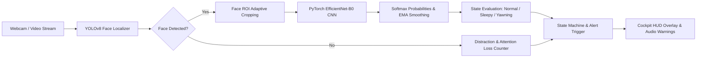

# 🚗 Driver Mood & Distraction Detection System

A high-performance, real-time Computer Vision and Deep Learning driver monitoring system built with **Python, PyTorch, OpenCV, and YOLOv8**. The system detects driver inattention, drowsiness, and fatigue by localizing the driver's face and classifying operational states using transfer learning with an **EfficientNet-B0 CNN**.

---

## 📌 Architecture & Pipeline



---

## 🌟 Key Features

- **Real-Time YOLOv8 Face Detection & Tracking**:
  - Accurately tracks driver facial coordinates even in variable cabin lighting, head rotation, and occlusions.
  - Automatically identifies the primary driver (closest/largest bounding area), filtering out passengers or background faces.
  - Generates adaptive bounding padding to preserve mouth and jawline regions during yawning.
- **EfficientNet-B0 Transfer Learning**:
  - Leverages pre-trained ImageNet feature representations.
  - Replaced top classifier head with custom linear, dropout, and SiLU layers.
  - High accuracy classification among `Normal`, `Sleepy`, and `Yawning`.
- **Intelligent Alert State Machine**:
  - **Sustained State Verification**: Mitigates false alarms by evaluating consecutive temporal frames (e.g., normal eye blinking vs. prolonged micro-sleeps).
  - **Drowsiness Alert**: Triggers alarm sound and flashing danger indicators when eyes remain closed.
  - **Fatigue Warning**: Flags frequent or prolonged yawning.
  - **Distraction Warning**: Detects driver looking away or leaving the frame.
- **Asynchronous Audio Alert System**:
  - Runs audio beeps in isolated background threads with cooldown guards, ensuring zero frame-drop or video stutter.
- **Automotive Cockpit HUD Overlay**:
  - Telemetry metrics: live FPS, confidence probability bars, risk gauges, and warning banners.
- **Integrated Dataset Collector**:
  - Built-in live webcam data collector with automatic 85/15 train-val splitting and burst-capture modes.
- **Dual Runtime Interfaces**:
  - High-performance desktop application via OpenCV.
  - Interactive web dashboard via Streamlit.

---

## 📂 Project Directory Structure

```
Driver_Mood_Distraction_Detection/
│
├── config.py                 # Central configurations, thresholds, and paths
├── requirements.txt          # Python dependencies
├── README.md                 # Project documentation & guide
│
├── dataset/                  # Labeled image dataset
│   ├── train/                # Normal / Sleepy / Yawning
│   ├── val/                  # Normal / Sleepy / Yawning
│   └── test/                 # Optional evaluation holdout
│
├── models/
│   ├── efficientnet_classifier.py  # PyTorch EfficientNet-B0 model architecture
│   ├── yolo_face_detector.py       # YOLOv8 face detector wrapper & fallbacks
│   └── weights/                    # Saved checkpoints (.pth & .pt)
│
├── src/
│   ├── alert_system.py       # Alert state machine & non-blocking audio
│   ├── hud_display.py        # Cockpit HUD graphics & telemetry bars
│   ├── data_collector.py     # Interactive webcam dataset collector
│   └── dataset_utils.py      # Transforms, data loaders & health checks
│
├── train.py                  # PyTorch model training pipeline
├── evaluate.py               # Confusion matrix & classification report generator
├── detect_realtime.py        # Live webcam real-time detector (OpenCV HUD)
└── app_streamlit.py          # Interactive web UI demo
```

---

## 🚀 Quickstart Guide

### 1. Environment Setup

Ensure Python 3.10+ is installed:

```bash
cd C:\Users\Victus\Driver_Mood_Distraction_Detection
pip install -r requirements.txt
```

### 2. Collect Training Data (Webcam)

If you'd like to collect custom training samples from your own webcam:

```bash
python src/data_collector.py
```
* **Hotkeys**:
  * `[1]`: Select **Normal** state
  * `[2]`: Select **Sleepy** state (close eyes or mimic drowsiness)
  * `[3]`: Select **Yawning** state (open mouth)
  * `[SPACE]`: Capture 1 frame
  * `[B]`: Burst capture 30 consecutive frames
  * `[Q]`: Exit and save

> *Note*: If you run `train.py` without existing data, it automatically creates sample starter data to verify the full pipeline end-to-end!

### 3. Train the EfficientNet-B0 Classifier

Run the transfer learning training pipeline:

```bash
python train.py
```
- Trains for 20 epochs with `CosineAnnealingLR` and `AdamW`.
- Saves the best checkpoint to `models/weights/efficientnet_b0_driver.pth`.
- Generates `training_curves.png` (Loss & Accuracy).

### 4. Evaluate the Model

Generate a detailed Classification Report (Precision, Recall, F1) and Confusion Matrix plot:

```bash
python evaluate.py
```

### 5. Run Live Real-Time Detection

Launch the real-time webcam detector:

```bash
python detect_realtime.py
```
* **Controls**:
  * `[Q]`: Quit
  * `[S]`: Toggle audio alerts (Mute / Unmute)
  * `[R]`: Reset alert counters
  * `[C]`: Capture event snapshot to `snapshots/`

### 6. Launch the Streamlit Web Application

To demonstrate the system in a browser:

```bash
streamlit run app_streamlit.py
```

---

## 🎯 Technical Highlights for Interviews & Resumes

- **Transfer Learning Optimization**: Leveraged pre-trained EfficientNet-B0 weights, fine-tuning top classification layers with Swish (SiLU) activations, dropout regularization (0.35), and label smoothing to combat overfitting.
- **Temporal Consistency & Debouncing**: Implemented an exponential moving average (EMA) smoothing queue and frame-persistence thresholds to differentiate natural blinks (~100-400ms) from sustained drowsy episodes (>600ms).
- **Concurrency & Non-Blocking Design**: Decoupled OpenCV frame ingestion and neural network forward-passes from audio alerts using daemon threads and cooldown mutexes, achieving steady 30+ FPS throughput.
